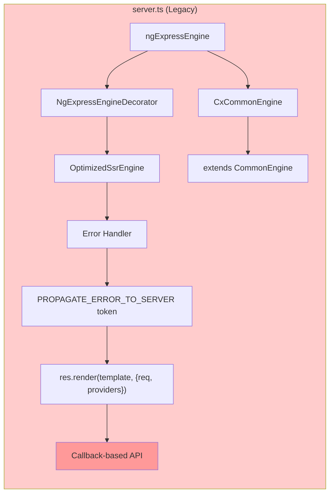
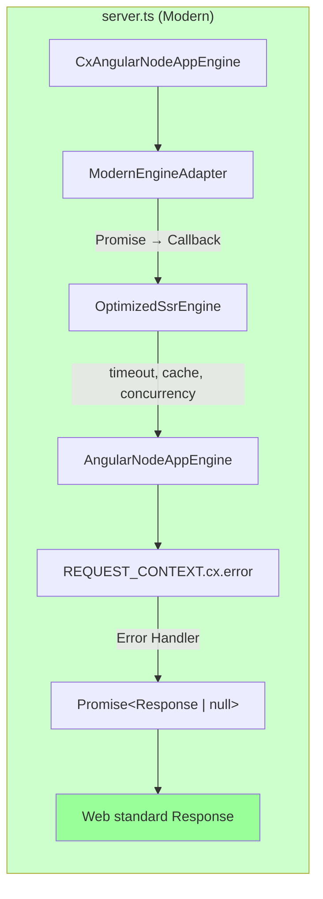
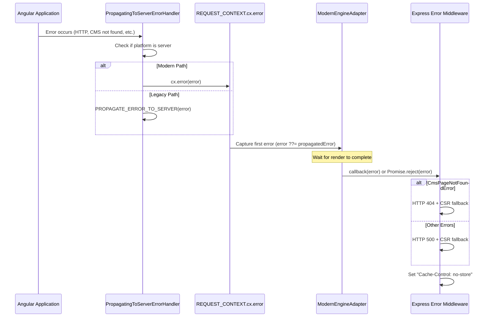
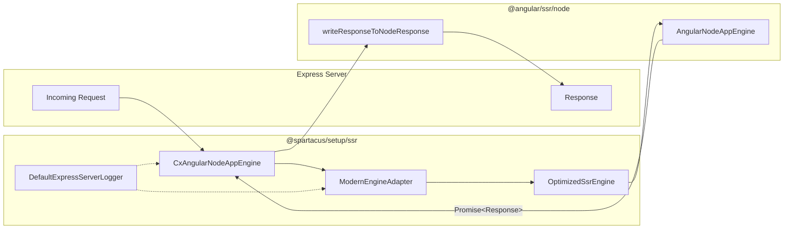

# Modernize Spartacus SSR

## Summary

This PR modernizes Spartacus Server-Side Rendering (SSR) by adopting Angular's native `AngularNodeAppEngine` with a Promise-based API, replacing the legacy callback-based `ngExpressEngine` approach. The new architecture provides better alignment with Angular's SSR direction while maintaining full backward compatibility and all existing optimization features.

## Motivation

- **Angular Alignment**: The `ngExpressEngine` was removed from Angular Universal in Angular 17. While Spartacus copied the implementation for backward compatibility, this approach creates technical debt.
- **Modern API**: Promise-based APIs are more ergonomic and compose better with async/await patterns
- **Web Standards**: The new architecture uses Web standard `Request`/`Response` objects, improving interoperability

## Architecture Changes

### Before (Legacy System)



### After (Modern System)



### Error Propagation Flow



### Component Interaction



## Key Changes

### New Files

| File                            | Purpose                                                                                                            |
| ------------------------------- | ------------------------------------------------------------------------------------------------------------------ |
| `cx-angular-node-app-engine.ts` | Spartacus wrapper for Angular's `AngularNodeAppEngine`. Always uses `OptimizedSsrEngine` for production-grade SSR. |
| `request-context.model.ts`      | Defines `CxRequestContext` interface for the `cx` namespace in `REQUEST_CONTEXT`                                   |
| `modern-engine-adapter.ts`      | Bridge adapter converting Promise-based API to callback-based API for `OptimizedSsrEngine`                         |

### Modified Files

| File                                     | Change                                                                                                                 |
| ---------------------------------------- | ---------------------------------------------------------------------------------------------------------------------- |
| `server.ts`                              | Rewritten to use `CxAngularNodeAppEngine` with Promise-based middleware pattern                                        |
| `propagating-to-server-error-handler.ts` | Updated to support both modern (`REQUEST_CONTEXT.cx.error`) and legacy (`PROPAGATE_ERROR_TO_SERVER`) error propagation |
| `express-logger.service.ts`              | Updated to resolve request/logger from both modern and legacy sources                                                  |
| `server-logger-service-factory.ts`       | Updated to detect Express context from both Angular's and Spartacus's REQUEST tokens                                   |
| `test-config-server.module.ts`           | Updated to read cookies from Web standard `Request` object                                                             |
| `express-error-handlers.ts`              | Fixed `instanceof` check for cross-bundle compatibility                                                                |

### Deprecated (but preserved for backward compatibility)

| API                          | Replacement                                    |
| ---------------------------- | ---------------------------------------------- |
| `NgExpressEngineDecorator`   | `CxAngularNodeAppEngine`                       |
| `ngExpressEngine`            | `CxAngularNodeAppEngine`                       |
| `CxCommonEngine`             | `CxAngularNodeAppEngine`                       |
| `PROPAGATE_ERROR_TO_SERVER`  | `REQUEST_CONTEXT.cx.error`                     |
| `EXPRESS_SERVER_LOGGER`      | `REQUEST_CONTEXT.cx.logger`                    |
| `REQUEST` (Spartacus token)  | Angular's `REQUEST` from `@angular/core`       |
| `RESPONSE` (Spartacus token) | Angular's `RESPONSE_INIT` from `@angular/core` |

## Usage

### Modern Server Setup (Recommended)

```typescript
import { writeResponseToNodeResponse } from '@angular/ssr/node';
import {
  CxAngularNodeAppEngine,
  DefaultExpressServerLogger,
  defaultExpressErrorHandlers,
} from '@spartacus/setup/ssr';
import express from 'express';

const logger = new DefaultExpressServerLogger();

const angularApp = new CxAngularNodeAppEngine({
  documentFilePath: join(serverDistFolder, 'index.server.html'),
  logger,
  optimization: {
    timeout: 3000,
    cache: true,
    concurrency: 10,
  },
});

const server = express();

// Serve static files
server.get(/.*\..*/, express.static(browserDistFolder, { maxAge: '1y' }));

// Handle SSR requests
server.use((req, res, next) => {
  angularApp.handle(req)
    .then(response => response ? writeResponseToNodeResponse(response, res) : next())
    .catch(next);
});

// Error handling with CSR fallback
server.use(defaultExpressErrorHandlers(indexHtmlContent));
```

### Legacy Server Setup (Still Supported)

```typescript
import { NgExpressEngineDecorator, ngExpressEngine } from '@spartacus/setup/ssr';

// This approach is deprecated but still works
const decoratedEngine = NgExpressEngineDecorator.get(ngExpressEngine, ssrOptions);
server.engine('html', decoratedEngine({ bootstrap }));
```

## The `cx` Namespace

Spartacus-specific context is passed via `REQUEST_CONTEXT.cx` to prevent property name collisions with customer-provided properties:

```typescript
interface CxRequestContext {
  error: (error: unknown) => void;  // Error propagation callback
  logger: ExpressServerLogger;       // Server logger instance
}

interface RequestContextWithCx {
  cx: CxRequestContext;              // Spartacus namespace
  [key: string]: unknown;            // Customer properties safe here
}
```

## Configuration Options

### CxAngularNodeAppEngineOptions

| Option             | Type                     | Required | Description                                                  |
| ------------------ | ------------------------ | -------- | ------------------------------------------------------------ |
| `documentFilePath` | `string`                 | Yes      | Path to index.html for CSR fallback                          |
| `optimization`     | `SsrOptimizationOptions` | No       | SSR optimization settings (defaults applied if not provided) |
| `logger`           | `ExpressServerLogger`    | No       | Custom logger (defaults to `DefaultExpressServerLogger`)     |

### Default Optimization Options

```typescript
const defaultSsrOptimizationOptions = {
  cache: false,
  cacheSizeMemory: 800_000_000,     // 800 MB
  concurrency: 10,
  timeout: 3_000,                    // 3 seconds
  forcedSsrTimeout: 60_000,          // 1 minute
  maxRenderTime: 300_000,            // 5 minutes
  reuseCurrentRendering: true,       // Dedupe concurrent requests
};
```

## Testing

All 7 SSR E2E tests pass:

| Test                               | Status |
| ---------------------------------- | ------ |
| Success response with request      | ✅      |
| 404 when page does not exist       | ✅      |
| 404 if HTTP error on cms/pages API | ✅      |
| 500 if HTTP error on other APIs    | ✅      |
| 500 if backend call times out      | ✅      |
| Cache hit for subsequent requests  | ✅      |
| Re-render after failed render      | ✅      |

## Migration Guide

### For Application Developers

1. Update `server.ts` to use `CxAngularNodeAppEngine`:

   ```typescript
   // Before (Legacy)
   const ngExpressEngine = NgExpressEngineDecorator.get(engine, ssrOptions);
   server.engine('html', ngExpressEngine({ bootstrap }));
   server.get('*', (req, res) => res.render(indexHtml, { req }));
   
   // After (Modern)
   const angularApp = new CxAngularNodeAppEngine({
     documentFilePath,
     optimization: { timeout: 3000, cache: true },
   });
   server.use((req, res, next) => {
     angularApp.handle(req)
       .then(r => r ? writeResponseToNodeResponse(r, res) : next())
       .catch(next);
   });
   ```

2. If using `PROPAGATE_ERROR_TO_SERVER` directly, migrate to `REQUEST_CONTEXT.cx.error`:

   ```typescript
   // Before
   const propagateError = inject(PROPAGATE_ERROR_TO_SERVER, { optional: true });
   propagateError?.(error);
   
   // After
   const requestContext = inject(REQUEST_CONTEXT, { optional: true });
   requestContext?.cx?.error(error);
   ```

## Spotted challenges:

 - Due to route extraction default for moder SSR with `outputMode: "server"` enabled, Angular's CLI analyzes application's routing configuration to discover all routes and their render modes. This happens during `ng build`, where Angular app is briefly bootstrapped to discover routes. Spartacus needs a `SERVER_REQUEST_ORIGIN value, but since this is just route discovery (not actual rendering), fallback should be good enough.
 - With modern app engine, If passed URL is not full, e.g. customers navigate to `/contact` instead of `<base-url>/<language>/<currency>/contact`, first response is returned with status 302, to inform about redirection