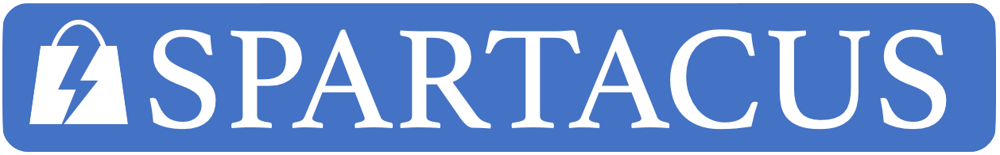

# What is Spartacus?

Spartacus is a lean, Angular-based JavaScript storefront for SAP Commerce Cloud. Spartacus talks to SAP Commerce Cloud exclusively through the Commerce REST API.

- Documentation is hosted on our dedicated [Spartacus Documentation site](https://sap.github.io/spartacus-docs/).
- Try out a [sample Spartacus storefront](https://spartacus-demo.eastus.cloudapp.azure.com/) on our public demo site.
- Technical questions? Get in touch with us on [Stack Overflow](https://stackoverflow.com/questions/tagged/spartacus-storefront).
- Non-technical questions? Join our [Slack workspace](https://join.slack.com/t/spartacus-storefront/shared_invite/zt-jekftqo0-HP6xt6IF~ffVB2cGG66fcQ).
- For details on the 2.0 launch, see the [Release Information page](https://sap.github.io/spartacus-docs/release-information/) on our Spartacus documentation site.

Spartacus is...

- **Extendable**: Spartacus is designed to be upgradable while maintaining full extendability. You'll be able to adopt new versions of Spartacus by updating the Spartacus libraries that we will regularly enhance. (In order to ensure that the first release is as extendable and upgradable as we'd like, breaking changes will very likely be introduced up until the 1.0 launch.)
- **Upgradable**: Spartacus code is published and used as libraries and follows semantic versioning conventions. By using the libraries, Spartacus is upgradable for minor and patch releases.
- **Progressive**: Spartacus is on a journey to be fully compliant with the Progressive Web Application (PWA) checklist. We aim to add support for all major features of a PWA-enabled storefront, to offer the best possible customer experience regardless of device or location.
- **Open Source**: Spartacus is open source. It will be continually developed by the SAP Commerce Cloud team, but we are very keen to welcome contributors and to foster an inclusive, active development community for Spartacus. See our [contributing documentation](CONTRIBUTING.md) for more information.
- **Modern**: The Spartacus storefront is part of our exciting new journey towards a customizable-yet-upgradable technology for SAP Commerce Cloud installations. See [SAP Customer Experience](https://cx.sap.com/en/products/commerce) for more information about SAP Commerce Cloud.

# Storefront Features

Spartacus provides core storefront features such as:

- Home page
- Search
- Categories
- Product details
- Cart page
- Adding to cart
- Checkout
- Order history

See the [Release documentation](https://sap.github.io/spartacus-docs/release-information/) for more information.

# Requirements

If you are working with Spartacus 3.x, your Angular development environment should include the following:

- [Angular CLI](https://angular.io/): **10.1** or later.
- node.js: 12.16.1 or later, < 13.0. The most recent 12.x version is recommended.
- yarn: v1.15 or later

If you are working with Spartacus 2.x, your Angular development environment should include the following:

- [Angular CLI](https://angular.io/): **9.1** or later.
- node.js: 10.14.1 or later, < 13.0. The most recent 12.x version is recommended.
- yarn: v1.15 or later

If you are working with Spartacus 1.x, your Angular development environment should include the following:

- [Angular CLI](https://angular.io/): v8.0.0 or later, < v9.0.0
- node.js: v10 or later, < v12
- yarn: v1.15 or later

For the back end, SAP Commerce Cloud version 1905 or higher is required, and SAP Commerce Cloud version 2005 or newer is recommended.

**Note:** Some Spartacus features require API endpoints that are only available in newer versions of SAP Commerce Cloud. For more information, see [Feature Compatibility](https://sap.github.io/spartacus-docs/feature-release-versions/) in the Spartacus documentation.

# Download and Installation

To get up and running with Spartacus, the recommended approach is to build your storefront application from ready-made libraries. You can also clone and build from source, but upgrading is not as simple.

Spartacus currently can only be used with a SAP Commerce Cloud instance through Commerce APIs.

To quickly add Spartacus libraries to an Angular application, you can use Spartacus schematics: `ng add @spartacus/schematics`. This will setup and install Spartacus libraries to your Angular project. Please check the [official Spartacus schematics documentation](https://sap.github.io/spartacus-docs/schematics/) for all the prerequisites and instruction on how to use Spartacus schematics.

For complete setup instructions, see [Building the Spartacus Storefront from Libraries](https://sap.github.io/spartacus-docs/building-the-spartacus-storefront-from-libraries/).

## Customizing and Extending Spartacus

To maintain our promise of upgradability, the design pattern for Spartacus is for non-core features to be built as feature libraries that add to or change the provided functionality.

When using Spartacus, you build an app that pulls in the Spartacus libraries, which contain the core resources needed to work with SAP Commerce. You then build new features that contain any custom functionality and pages.

Content for Spartacus pages is fetched from the SAP Commerce Cloud CMS (Content Management System), such as logos, links, banners and static pages. We recommend that new content-driven features follow the same pattern to enable Content Managers to modify page content through the CMS tools.

The documentation for customizing and extending Spartacus is still under development and is being released as it becomes available.

# API Documentation

The Spartacus API documentation is hosted here: [https://sap.github.io/spartacus/](https://sap.github.io/spartacus/)

The API documentation is versioned and is included in the **Assets** folder of each and every Spartacus library. You can download the API documentation for a particular version by accessing the **Assets** folder of any Spartacus library from that particular release, and then clicking on `docs.tar.gz` or `docs.zip`. To find the **Assets** folder for a particular library, access the [Released Libraries for Spartacus](https://github.com/SAP/spartacus/releases), click on the link for the library you are interested in, and scroll to the bottom of the page.

For example, to download the API documentation for the 2.0.0 release, you could access the **Assets** folder of the `@spartacus/storefront@2.0.0` library [here](https://github.com/SAP/spartacus/releases/tag/storefront-2.0.0).

**Note:** The 1.x and 2.x releases of the Spartacus libraries work only with SAP Commerce versions 1905 and 2005. Certain features, such as cancellations and returns, are only available with SAP Commerce 2005, because the necessary OCC API support is only available in SAP Commerce 2005.

**Note:** The Spartacus API is separate from the Commerce OCC REST APIs that Spartacus consumes. For more information, see the [Commerce API Documentation and YAML Files](https://help.sap.com/viewer/c5613bd3cc9942efb74d017b40eb0892/latest/en-US/18caa4b5c32c4bcf8b38c6260c0f30e8.html) on the SAP Help Portal.

# Limitations

When 1.0.0 is released, it is recommended to use SAP Commerce 1905. Spartacus works with Release 1808 and 1811 of SAP Commerce Cloud, with some limitations.

Spartacus is also being updated so that it works well with upcoming releases of SAP Commerce Cloud. This means that certain features of Spartacus may only work with unreleased future editions of SAP Commerce Cloud. This will be noted as we release new versions of Spartacus.

# Known Issues

Known issues are documented in the GitHub issue tracking system.

# How to Obtain Support

Spartacus is provided "as-is" with no official lines of support.

To get help from the Spartacus community:

- For more general questions, post a question in the Help chat of our [Slack workspace](https://join.slack.com/t/spartacus-storefront/shared_invite/zt-jekftqo0-HP6xt6IF~ffVB2cGG66fcQ).
- For developer questions, post a question to [Stack Overflow with the 'spartacus' tag](https://stackoverflow.com/questions/tagged/spartacus).

# Contributing

Team Spartacus welcomes feedback, ideas, requests, and especially code contributions.

- Post comments to our Feedback chat in our [Slack](https://join.slack.com/t/spartacus-storefront/shared_invite/zt-jekftqo0-HP6xt6IF~ffVB2cGG66fcQ) channel.
- Read the [Contributing document](CONTRIBUTING.md) and learn how to:
  - Help others
  - Report an issue
  - Contribute code to Spartacus

# To Do

Many improvements are coming! All tasks will be posted to our GitHub issue tracking system. As mentioned, some of the improvements will mean breaking changes. While we strive to avoid doing so, we cannot guarantee this will not happen before the first release.

# License

Copyright (c) 2018 SAP SE or an SAP affiliate company. All rights reserved.
This file is licensed under the Apache Software License, v. 2 except as noted otherwise in the [LICENSE](LICENSE) file.

