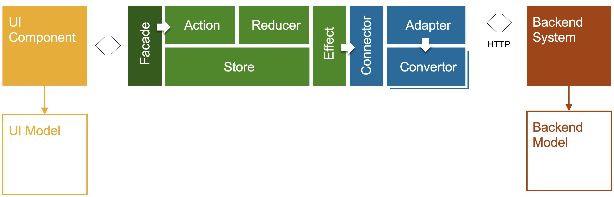

# Data Binding

The system landscape of a Commerce solution is made up of various systems. The systems are typically orchestrated on various application layers, including the front end. While the Spartacus component UIs connect to SAP Commerce Cloud APIs by default, the underlying framework can be used to *adapt* other systems as well. This is done by so-called connectors which can be added to connect to other systems.

## Component Data Binding

Spartacus delivers view logic that binds to (complex) commerce data and logic in the commerce back end. Angular provides standards for data binding and relies on reactive programming as the best-practice standard pattern for data binding. A number of best practices are used for data binding:

- UI components bind to observable data from the back end, using Angular's standard `async`.
- UI components do not store response data from observables locally, so that destroy logic can be avoided. RxJS *pipeable* logic can be applied to implement any logic when data is observed.
- back end data is stored in a central data store, provided by a state management system (Spartacus uses ngrx).
- The complexity of the state management system is fronted by a facade layer to provide a simple API to component developers.
- The back end system is configurable by connector, adapter and convertor logic. Customers can provide alternative implementations to adapt a specific back end.

This design involves multiple layers:

- **UI components**: The UI layer is only concerned with view logic of the UI. UI components observes data provided by the facade layer.
- **Facade layer**: The facade layer hides the complexity of the in-memory data store (ngrx). This layer is designed to simplify your development, and let you focus on custom view logic.
- **In-memory Store (ngrx)**: Spartacus uses ngrx for state management. Ngrx is considered complex and therefor you can use the facade layer.
- **Back end connector**: The back end connector is called by ngrx *effects*, and return the response from the back end in the required UI model. The connector delegates to an adapter, which interacts with a back end system.



While this is a pretty complex setup, you don't need to worry about most layers. When you want to connect a UI component to an alternative data source, you would customize some low level layers without being concerned with the facade layer or data store. Only if alternative client-side business logic is required, you would provide additional logic, most likely close to the UI layer.  

## Connector Logic

The Connector logic sits between the in-memory data store (ngrx) and the back end. A specific connector per domain is used to offload the connection to a back end system. For example, the product connector takes care of loading product details.

To provide optimal flexibility, there are three entities involved to connect a back end system:

1. Connector
2. Adapter
3. Convertor

This is a common pattern across different frameworks and technology stacks, although different names are used (for example, convertor vs. populator vs. serializer, etc.).

The fine-grained setup will help to separate concerns and simplifies further customization. That being said, when you bind to an alternative data source, nothing stops you from simplifying this setup.

### 1. Connector

The connector orchestrates the connection to a source system. The connector layer could be considered over-engineered, but there are occasions where standard data is provided, even in the case of switching to an alternative system. An example of this is when structured CMS data is loaded: Spartacus can be set up to add static CMS data without relying on a back end at all or as a fall-back in case the CMS doesn't provide sufficient data.

The main task of the connector is to delegate the loading and conversion of back end data to the adapter.

### 2. Adapter

The adapter layer is responsible for loading and submitting data to a source system. By default, Spartacus adapts OCC, the standard REST API of SAP Commerce Cloud. The adapters (and convertors) are shipped and provided in separate modules, so that they become optional in the final build, in case you wish to adapt an alternative system.

The endpoints used in OCC adapters can be configured, so that the customization of Spartacus can be very light-weight. Only if you adapt another system, it might be needed to provide a custom adapter. More on OCC endpoint configuration can be found further down in this page.

Spartacus delegates the conversion of back end to UI models (and vice versa) to convertors. Convertors are optional: when no convertor is found for the given domain, the source data will be returned.

### Convertor Logic

Convertors are used to convert data from the back end to the UI and vice versa. Spartacus uses the following to distinguish the two flows:

- **Normalize** is the conversion from back end models to UI models
- **Serialize** is the conversion of UI models to back end models (in the case of submitting data to the back end).

In order to provide optional conversion, the convertors are so-called multi-providers, which allows Spartacus to provide specific convertors. A good example of an optional normalizer is the additional data that is required for the SmartEdit integration. This integration requires some additional attributes on the final DOM. Spartacus *provides* an optional convertor that normalizes additional data from the back end source to the UI model.

Convertors are optional. Whenever the back end model is equal to the UI model, or in the case of simple conversion, the adapter could easily take care of this.

## Endpoint Configuration

REST endpoints provided by OCC are often configurable. Most endpoints have an optional field parameter that dictates the response data that is returned. While this configuration can also be driven by a (JAVA Spring) back end configuration, doing this at runtime in the front end gives more flexibility and limits customizations in the back end.

For this reason, OCC modules in Spartacus allow for endpoint configuration. The following code snippet shows a custom configuration for the product detail endpoint:

```typescript
backend: {
  occ: {
    baseUrl: environment.occBaseUrl,
    endpoints: {
    product:
        'products/${productCode}?fields=DEFAULT,customAttribute',
    }
  }
}
```

The OCC configuration is used in the `OccEndpointsService`. The service looks up the configuration and applies parameters to the endpoint if needed.
