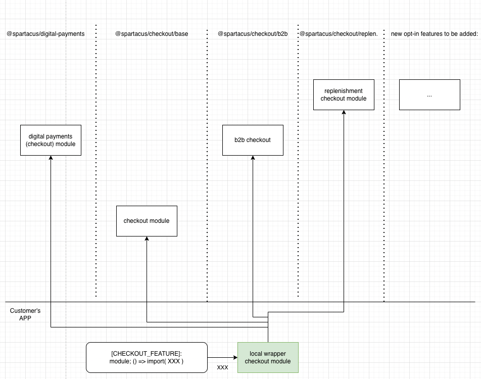

## 1. Title
Extend lazy loaded code

## 2. Status
Proposed

## 3. Involved areas
extensibility, lazy-loading, dependency injection, schematics installation

## 4. Context
_Explain why the decision is being taken_

New opt-in Spartacus features should be able to extend the existing lazy-loadable Spartacus features. We didn't have a need for it yet, but now we have a big need. It’s because we extract more-and-more code to lazy-loaded modules and we decouple more-and-more code into independent, opt-in, composable “plugin-like” libraries. And the usual techniques for extending services, don't work in the case of lazy-loaded modules.

The usual technique of providing the extending service in the root injector, e.g. `{provide: ..., useClass:...}` in the `AppModule` (or any other statically imported module) doesn't overwrite the base service in the lazy-loaded module. The lazy-loaded module instantiates its own, fresh child-injector, which derives from the parent (root) injector, but locally has a higher priority than the parent one. And because the base service implementation is provided in the lazy-loaded module that has its own child-injector, the extension service provided in the root injector cannot overwrite the base one.

We need to find a way to automatically install (via schematics) the opt-in libraries, so they extend the existing lazy-loaded features originating from different libraries. We should find an optimal, future-proof solution, because it might be used very often in OOTB Spartacus soon.

Note: For details on instantiating the lazy-loaded modules and setting the parent injector, see the implementation of Spartacus' [LazyModulesService#resolveModuleInstance](https://github.com/SAP/spartacus/blob/a1421cf95481c6f2b59926a91f4e9380ff10f70b/projects/core/src/lazy-loading/lazy-modules.service.ts#L86). 

Note: At the time of writing, our schematics create in the app the dynamic imports pointing directly to the path of Spartacus feature library. See the following example for the checkout feature:

```ts
// CheckoutFeatureModule in the app:
provideConfig({
  featureModules: {
    [CHECKOUT_FEATURE]: {
      module: () =>
        import('@spartacus/checkout/base').then((m) => m.CheckoutModule),
        // point to library's path 👆
    },
  },
}),
```

## 5. Alternatives considered
_List the alternative options you considered with their pros and cons_

### Option 0 (currently used): Pre-baked wrapper modules in the Spartacus extension library
Idea: The module of Spartacus extension library acts as the wrapper module, importing both the base feature module as well as providing custom extensions. See the following example for Digital Payments feature that extends Checkout:
```ts
// DigitalPaymentsModule in @spartacus/digital-payments:

import { CheckoutModule } from '@spartacus/checkout/base';
import { DpCheckoutModule } from './checkout/dp-checkout.module';

@NgModule({
  imports: [CheckoutModule, DpCheckoutModule],
})
export class DigitalPaymentsModule {}
```

The schematics installer of the Digital-Payments library adds a new file in the app, providing the config chunk for the same feature key `CHECKOUT_FEATURE`, pointing to the extension library's path (instead of the original feature library's path):

```ts
// DigitalPaymentsFeatureModule in the app:
provideConfig({
  featureModules: {
    [CHECKOUT_FEATURE]: {
      module: () =>
        import('@spartacus/digital-payments').then((m) => m.DigitalPaymentsModule),
        // point to extension library's module 👆
        // which inside wraps the original CheckoutModule 
        // and provides custom extensions
    },
  },
}),
```

The following diagram shows that e.g. digital payments module imports statically the original checkout module. And in the app our dynamic import points to the digital payments module.


Unfortunately, this approach allows for installing automatically (via schematics) only one extension feature for one base feature. This is a blocker issue. Taking as an example the Checkout feature, customers might want to use many possible opt-in extensions originating from vaious Spartacus libraries, e.g. `DigitalPaymentsModule`, `B2bCheckoutModule` or `ScheduledReplenishmentCheckoutModule`. The following diagram pictures the dillema, to which library's the dynamic import should point to:


Note: at the time of writing, this solution is used in the `develop` branch, with known limitations. See https://github.com/SAP/spartacus/blob/780cd570ca56b2f55a94872b4c0f7ae30b5fdccd/integration-libs/digital-payments/src/digital-payments.module.ts#L5-L8

#### Pros:
- It works

#### Cons:
- You canot compose and use many extensions for one one base feature

### Option 1: Local wrapper module in the app
Idea: Introduce a local wrapper module in the app and import it dynamically instead of the base Spartacus module:
```ts
// CheckoutFeatureModule in the app:
provideConfig({
  featureModules: {
    [CHECKOUT_FEATURE]: {
      module: () =>
        import('./checkout-wrapper.module').then((m) => m.CheckoutWrapperModule),
        // point to a separate file in the app 👆
    },
  },
}),
```

Then inside the local wrapper module we primarily import (statically) the base Spartacus module, but also allow for importing (statically) many other extensions modules. 

Because the child-injector belongs to the wrapper module (as it's lazy-loaded), and both the base and the extension modules are imported inside the wrapper module, they all share the same child injector. Therefore the extension service can overwrite the base service. The following example shows the content of the `CheckoutWrapperModule` in the app:

```ts
// CheckoutWrapperModule in the app:

import { CheckoutModule } from '@spartacus/checkout/base';
import { DigitalPaymentsModule } from '@spartacus/digital-payments';

@NgModule({
  imports: [ 
    // base module providing base service:
    CheckoutModule, 
    
    // extension module with providers overwriting the base service:
    DigitalPaymentsModule 
  ]
})
export class CheckoutWrapperModule {}
```

The working example can be found in the PoC PR: https://github.com/SAP/spartacus/pull/14871

The following diagram shows possibility of composing many extensions for the checkout feature:



Assuming, that the lazy-loadable feature has its own wrapper module in the app, the installation of the extension features means appending the extension module inside the wrapper module.

The installer should basically locate the import of the base feature module in the customer's codebase (e.g. import of `CheckoutModule`), and append the extension module (e.g. `DigitalPayments`) after it. The followin example shows the content of the wrapper module, including the CheckoutModule (being a marker for the schematics installer) and the extensions modules `B2bCheckoutModule` and `DigitalPaymentsModule` imported after the marker:

```ts
// CheckoutWrapperModule in the app:
@NgModule({
  imports: [
    CheckoutModule,       // marker where to append extension modules
    B2bCheckoutModule,    // <-- appended by schematics
    DigitalPaymentsModule // <-- appended by schematics
  ],
})
export class CheckoutWrapperModule {}
```

The wrapper modules should be called `XxxWrapperModule`. For reference, here are alternatives that were considered, based on the example of `CheckoutModule`:
- `CheckoutWrapperModule` ✅ 
- `CheckoutExtensionModule`
- `CheckoutExtendedModule`
- `CheckoutCustomModule`
- `CheckoutCustomizedModule`
- `CheckoutLocalModule`


Note: the order of installing libraries is important. The base feature must be installed first (to add a marker module in the code), and the extensions must be installed after the base feature (because they would look for the marker module).

#### Pros
- It works
- by the way, it improves the customer's developer experience - it shows the straightforward place where customers they can overwrite our OOTB services in a lazy-loaded feature (nowadays the [documentation says customers need to create wrapper modules themselves manually](https://sap.github.io/spartacus-docs/lazy-loading-guide/#customizing-lazy-loaded-modules))
- additionally, it allows for tree-shaking any unused public API of the feature library entrypoint (which was not the case previously, when importing dynamically module from the direct path of the library)

#### Cons
- we add more modules in customer's app
- negligible(!) increase in the production built JS bundle of the lazy-loaded feature: 100-200 bytes (depending on the length of the class name).
  - Note that the OOTB `UserProfileModule` feature has 42.15 kB at the moment of writing. So the increase in this case is 0.3% and it affects only the lazy-loaded chunk, but not the main JS chunk. 


#### Consequences

- [x] does it increase the production main JS bundle size?
  - NO
- [x] does it cause producing more JS chunks than before?
  - NO
- [x] will it break lazy loading when we statically import the base module inside the wrapper module?
  - NO
- [x] should we adapt our _installation schematics_ to create wrapper modules OOTB? 
  - YES
- [x] should we create wrapper modules for all features or only those that are extended by other opt-in features?
  - ONLY THE EXTENDED ONES, not to introduce unnecessary boilerplate in the app
- [x] should we automate for customers cration of the wrapper modules out from the old dynamic imports pointing to Spartacus library's path (e.g. `()=>import('@spartacus/store-finder')`))?
  - YES, the local wrapper should be created on the fly by the installer of the extension module
- [x] how should the installer behave, when there is no marker module in the app (e.g. because customer dismantled it into smaller modules)
  - WARN in the console and explain how to import the module manually
- [x] how should the installer behave, when customer is not using lazy loading (i.e. when the marker module is imported only statically)
  - NOTHING DIFFERENT, just append the extension module after the base module
- [x] should we update our installer, so it first installs the base feature and only later the extensions?
  - YES, we need to add a logic that analyzes the dependencies between feature and extension modules and then installs all features in the correct order
- [x] how do we name the wrapper modules?
  - WrapperXxxModule
- [ ] it might seriously complicate the future automated migrations in case we will change in the future the suggested division of the features in to lazy-laoded chunks (e.g. we propose more fine-grained or reorganized chunks).
  - TBD: in the end of the day, it's up to customers to decide how to optimize their code. But it would be good to provide nice OOTB experience.
- [ ] how does the shell app look files structure look like if every feature is blown into many modules (main feature module with configs, and one or more lazy-loaded wrapper feature modules)
  - TBD
- [ ] can we have one library entry point for multiple lazy-loaded modules? if yes, how do we enforce boundaries?
  - TODO 
  
#### Plan of implementation

After 5.0:
1. implement schematics util that breaks down the given dynamic import into a wrapper module, e.g:

    `ng g @spartacus/schematics:wrapper --module=CheckoutModule --module-path=@spartacus/checkout/base`
2. implement schematics util that appends the given extension module after another "marker" module, e.g:
    
    `ng g @spartacus/schematics:append-module --module=DigitalPaymentsModule --module-path=@spartacus/digital-payments --after-module=CheckoutModule --after-module-path=@spartacus/checkout/base`
3. change the implementation of the installation-schematics of our extension features (e.g. DigitalPayments, CheckoutB2b) use the two util schematics above. For example: to install the Digital Payments feature (`ng add @spartacus/digital-payments`): first make sure to break down the dynamic import of `CheckoutModule` into a local wrapper module and only then append the `DigitalPaymentModule` after the `CheckoutModule`.

Issues with current develop branch:
1. because of putting the pre-baked modules into customers app (so the base module is implicitly imported inside), there is no notion about the base module the customer's code. Therefore the base module cannot be the marker for generating the wrapper modules in the future.
   - possible solutions:
     1. workaround: the future schematics generating the wrapper module for the Checkout will accept an array of possible maker modules (e.g. `CheckoutModule, CheckoutB2BModule, DigitalPaymentsModule`)
        - cons: we will have to change in 6.0 those pre-baked wrapper modules (it's tech dept to pay in the future)
     2. ...?
2. Currently the Digital Payments installation-schematics creates a separate module file with the config chunk using the same key `CHECKOUT_FEATURE`, but different dynamic import path. It overwrites the original dynamic import implicitly thanks to config chunks being deep-merged together 
   - possible solutions:
     - change implementation of installation-schematics of Digital Payments to update the dynamic import "in place" inside the original Checkout module file. But this requires(!) the checkout installation-schematics to be run first. And also this requires(!) defining a marker module for replacement.

Suggested TODO before 5.0:
1. implement the ordered invocation of specific libraries' installation-schematics (including the deep analysis of the cross-dependencies between features)
1. changes needed in current installation-schematics of DigitalPayments and CheckoutB2B (and CdcLogin which is under development):
  - current state:
    - CheckoutB2b schematics removes the original checkout file and re-creates it, using key different path in the dynamic import
      - it can stay I guess
    - DigitalPayments creates a separate module file with the same key `CHECKOUT_FEATURE`, but different dynamic import path 
      - it's problematic as there is no single file where we could break down the dynamic import


### Option 2: Configure the extension module as `dependencies` of the lazy-loaded feature module
Spartacus allows for configuring `dependencies` for a feature module, for example:

```ts
provideConfig(<CmsConfig>{
  featureModules: {
    [USER_PROFILE_FEATURE]: {
      module: () =>
        import('@spartacus/user/profile').then((m) => m.UserProfileModule),

      dependencies: [
        () =>
          import('@spartacus/some-extension-library').then(
            (m) => m.ExtensionUserProfileModule
          ),
      ],
    },
  },
}),
```
This allows for injecting services from the dependency module.

Unfortunately for us, the dependency module's injector has lower priority than the original feature module). It's because the instantiated feature module has it's own injector. So the extension services cannot overwrite the original services.

So this this option is disqualified as it's not solving our problem.

*Note*: why the dependency module's injector cannot have higher priority than the feature module's injector? It's because the Angular's public API allows only for setting a *parent injector* for the dynamically instantiated module: `NgModuleFactory<any>.create(parentInjector: Injector | null): NgModuleRef<any>`. And the parent injector, by definition has a lower priority than the injector of the instantiated module. 

### Option 3: Configure the original module as `dependencies` of the extension module (tweaked Option 2)
We could tweak the Option (2), and set the extension module as the main feature `module`, while setting the original feature module only as `dependencies`. Then the injector of the extension module should have higher priority than the original feature module, when resolving services. See example:

```ts
provideConfig(<CmsConfig>{
  featureModules: {
    [USER_PROFILE_FEATURE]: {
      module: () =>
        import('@spartacus/some-extension-library').then(
          (m) => m.ExtensionUserProfileModule
        ),
      
      dependencies: [
        () => import('@spartacus/user/profile').then((m) => m.UserProfileModule),
      ],
    },
  },
}),
```
We're hoping that this configuration should promote injecting services from the extension module over the services from the original feature module.

Unfortunately, then we get an error:
```
core.js:6456 ERROR TypeError: Cannot read properties of undefined (reading 'pipe')
    at ComponentWrapperDirective.launchComponent (component-wrapper.directive.ts:121:8)
```

It's because the implementation of the method `CmsComponentsService#determineMappings` picks the CMS component mappings only from the pointed `module`, but not from its `dependencies`. And in our case the extension module doesn't contain all those component mappings, instead they live in the original feature module (which is now set as `dependencies`).

As a next step we could possibly change the behavior of `CmsComponentsService#determineMappings` to pick also cms mappings from the dependency modules.

### Pros
- It doesn't require creating a new wrapper module in customer's app

#### Cons
- it doesn't work OOTB
- even if we make it work (e.g. by changing behavior of `CmsComponentsService#determineMappings`):
  - it doesn't allow for plugging many independent extensions to a single feature feature (because the config allows for only one main feature `module`)
  - it would require changing at least a core service `CmsComponentsService`, that most of the application depends on (indirectly)

#### Interesting
- will it solve our problem, if we change the behavior of `CmsComponentsService#determineMappings` to pick  mappings also from the `dependencies` modules?
  - how much complexity will it introduce to the code?
  - if it works, what will be the consequences of picking cms mappings not only from the main feature `module`, but also from `dependencies` modules?
    - what if a single dependency module is reused as a dependency of more than one feature module? Should it then populate its mappings to more than one feature module?
    - does it even make sense (semantically) to provide the cms mappings in a dependency module?
    

###


### Option 4: Introduce a config `plugins` for lazy-loaded feature modules; implementation: use static empty NgModule + parent CombinedInjector
We want to allow for plugging many extensions for a single module. And ideally we would like to avoid changing the original module in customer's app, when plugging the extensions. In other words, we a want loose coupling between the original feature module and the extension modules in the app. See example structure in the customer's app:
```
|- user-feature.module.ts
|- some-extension.module.ts
```

```ts
// user-feature.module.ts - unchanged, created by schematics as of today
provideConfig(<CmsConfig>{
  featureModules: {
    [USER_PROFILE_FEATURE]: {
      module: () =>
        import('@spartacus/user/profile').then((m) => m.UserProfileModule),
    },
  },
}),
```

```ts
// some-extension.module.ts
provideConfig(<CmsConfig>{
  featureModules: {
    [USER_PROFILE_FEATURE]: {
      plugins: [ // PROPOSAL OF THE NEW CONFIG PROPERTY
        () =>
          import('@spartacus/some-extension-library').then((m) => m.UserProfileModule),
      ]
    },
  },
}),
```

TODO:
- plugins should be able to populate the CMS mappings and services. and should overwrite default CMS maapings and services

IMPLEMENTATION DETAILS:
As the feature module we set artificially an empty Module. And when instantiating it, we set its parent injector to the `CombinedInjector` consisting of (in the following order): the plugins' injectors, the original feature module's injector and dependencies' injectors.
This should allow for injecting services first from plugins modules, then from original feature module, and later from dependencies modules.

#### Pros
- it doesn't require importing both the original and plugin modules in the same file (in the wrapper module)
  - to install an extension, you don't need to know the filename of the wrapper module, but only the feature name, e.g. `USER_PROFILE_FEATURE` 
- extensions modules (plugins) can live in separate files. The original modules remain untouched 

#### Cons
- it doesn't work properly for multi-provided tokens (including `MODULE_INITIALIZER`s)
  - in details: `CombinedInjector` returns the array of multi-provided tokens only from the first complementary injector that provides the tokens. In other words, `CombinedInjector` cannot return an array combining all multi-provided tokens in all complementary injectors. 
- adds a bit of more non-trivial logic ("magic") to the Spartacus lazy loading and dependency injection


TODO: We need to create a working PoC

### Interesting
- 

### Option 5: Introduce a config `plugins` for lazy-loaded feature modules; implementation: create wrapper module in runtime by JIT compiler (tweaked Option 4)
We could tweak the Option (5), and create the wrapper module importing the original module all the plugin modules in the runtime. This helps to avoid using the opinionated `CombinedInjector`.

Interesting:
- did we already use JIT in `develop` branch? How can we prove we did or not? We have already been calling `compiler.compileModuleAsync()` in develop.
  - NO. How to prove: when trying to create NgModule in rutime I gout error that JIT compiler is not available.
- Angular documented several drawbacks of using JIT: increased bundle size and increased runtime (due to compilation happening in the browser). But are those docs still up to date with regards to IVY and Angular 12/13? See https://angular.io/guide/aot-compiler
- Should we use JIT in general? Angular may remove the JIT compilation in the (far?) future, however it’s not definitely decided yet. See [RFC](https://github.com/angular/angular/issues/43133#issuecomment-941151334).
- using JIT compiler introduces [some security concerns](https://angular.io/guide/security#use-the-aot-template-compiler). How much will we be affected, when calling compileModuleAsync or the alternative function createNgModuleRef() (that was introduced only in v13)


TODO: We need to create a working PoC

## 5. Decision
_Elaborate the decision_

TODO

## 6. Consequences
_What becomes easier or more difficult to do because of this change?_

TODO

### Order of installing libraries separately becomes important
When installing libraries separately via bash installation script, the order of installing libraries becomes important, e.g.:
```bash
ng add --skip-confirmation @spartacus/checkout --interactive false
ng add --skip-confirmation @spartacus/digital-payments --interactive false
# not the extension should go after the default feature 👆
```

Instead of installing libraries separately, it's recommended to run `ng add @spartacus/schematics --features=...` (which automatically takes care about the order of installing libraries):
```bash
ng add --skip-confirmation @spartacus/schematics --interactive false \
  --features=Digital-Payments \
  --features=Checkout
# order of `--features` is NOT important above 👆
```