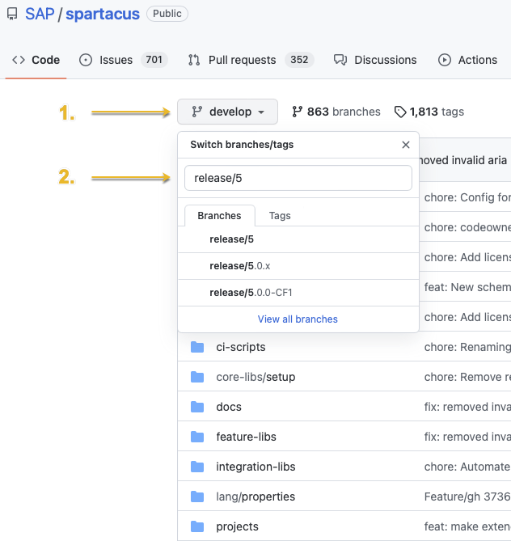

# Self-Publishing Spartacus Libraries Using the Open Source Code

The procedures on this page describe how to check out the Spartacus source code, build the libraries locally, and then make them available for installation. This allows you to use the Spartacus libraries that you have compiled, and as a result, accessing Spartacus packages from the npm repository is no longer necessary.

## Prerequisites

Before starting any the procedures on this page, you must fulfill the follow prerequisites:

- Install the appropriate versions of node.js and Angular CLI for the release you are building.
- Install the ts-node TypeScript execution engine. To install ts-node, open a terminal window and enter the following command:

    ```bash
    npm install -g ts-node
    ```

- Install an npm-like registry software, such as Verdaccio, which is a lightweight Node.js private proxy registry. To install Verdaccio, open a terminal window and enter the following command:

    ```bash
    npm install -g verdaccio@4
    ```

## Building and Serving the Spartacus Libraries Using a Local Registry

In the following procedure, Verdaccio is used in the steps involving registry software, but you can use any proxy registry software that is similar to npm.

**Note:** These steps assume that your proxy registry is already running in a terminal window.

For more information about using Verdaccio or another registry software, see the [Prerequisites](#prerequisites) section, above.

1. Open a terminal window.

1. Run the following command to clone the Spartacus repository from GitHub and then change to the directory of the cloned repo:

    ```bash
    git clone https://github.com/SAP/spartacus.git && cd spartacus
    ```

1. Use the branch or tag name to check out the branch of the required release version.

    For example, the following command checks out the first code-frozen 5.0.0 release, which is in branch `release/5.0.0-CF1`:

    ```bash
    git checkout release/5.0.0-CF1
    ```

    When choosing a tag or branch, use the specific major.minor.patch (for example, `5.0.0`) of the release you want to use. The latest release is always recommended.

    You can use the `git branch` command to confirm which branch you are on.

    **Note:** You can use the dropdown menu for switching branches in the top left of the main page of the [Spartacus GitHub repository](https://github.com/SAP/spartacus) to see which releases are available. Click on **develop**, enter `release/5` in the search field that appears in the dropdown menu, and you will see all of the available releases for version 5.0.0 and newer, as shown in the following example:

    

1. Run the following command to install packages and then build the libraries:

    ```bash
    npm install && npm run build:libs
    ```

1. Run the following schematics testing script provided by the Spartacus project:

    ```bash
    ts-node ./tools/schematics/testing
    ```

    DISCLAIMER: The script located in `tools/schematics/testing.ts` is for building the libraries only, and is subject to change. You can use this script as an example, or you can save and modify it according to your needs.

1. Do not publish yet. To avoid having to enter user details as each package is published locally, open a separate terminal window, run the following command, and enter a username, password, and email when prompted:

    ```bash
    npm adduser --registry http://localhost:4873
    ```

1. In the terminal window running your proxy registry (such as Verdaccio), select the `Publish` option and press `Enter`.

    The `Publish` command creates a local repository for Spartacus packages to be installed. It also redirects npm to use this repository instead of `npmjs.com` (only for `@spartacus/*` packages).

1. If you did not add an npm user in the previous step, you may be asked for an npm user name for each library. In this case, press `Enter` each time to use `public`.

    **Note:** After publishing, you will be asked what to do next. Do not close the window after publishing. The local Verdaccio repository only remains accessible for as long as the script is running. Published packages will be lost after closing the script.

    You can see the published libraries by browsing to [http://localhost:4873/](http://localhost:4873/) while Verdaccio is running.

## Upgrading or Creating an Application Using the Local Repository

When using the local repository method, the next steps (upgrading or creating a new application) do not differ from the standard documented steps for upgrading or creating a new Spartacus application. The `@spartacus` packages are obtained from the local npm-like registry you are running, and everything else is obtained from standard sources.

### Installing Libraries in a New App

This procedure can be used to create a fresh application.

1. In a new terminal window, use the following command to create a new Angular app and then change to the directory of the new app folder:

    ```bash
    ng new spartacus-app --style=scss && cd spartacus-app
    ```

1. Type `N` and then press `Enter` when prompted for Angular routing.

1. Add Spartacus dependencies by running the following command:

    ```bash
    ng add @spartacus/schematics --baseUrl https://commercebackendurl
    ```

1. Follow the onscreen instructions that appear after running the command.

    The Spartacus libraries will come from your local npm repository provided by your registry software (such as Verdaccio).

    You can open `node_modules` and check the `@spartacus` libraries that were installed.

1. You can exit the proxy registry when the installation is complete.

    If you are using Verdaccio, you can end the script by selecting `Exit`. Do not force-close the script; doing so will prevent cleanup from running, and as a result, the script may not run correctly in the future.
1. Start the application. You should now be running with the latest Spartacus libraries installed.

## Upgrading an Existing Spartacus App

Before upgrading your Spartacus app to version 5.0, you first need to make sure your Angular libraries are up to date. Spartacus 5.0 requires Angular 14.

### Upgrading Your Angular Libraries

You can upgrade your application to Angular 14 as follows:

- Start by upgrading Angular to version 13, and verify that all breaking changes have been addressed.
- When you have updated to Angular 13, you can then upgrade to Angular 14.

You might have to append the `--force` flag if you encounter a mismatch between peer dependencies during the migration. The following is an example command that upgrades Angular to version 13.

```bash
ng update @angular/cli@13 --force
```

Afterwards, you need to upgrade third party dependencies to the version that is compatible with Angular 14, such as `@ng-bootstrap/ng-bootstrap`, `@ng-select/ng-select` or `@ngrx/store`.

For more information, see the official [Angular Update Guide](https://update.angular.io/).

### Upgrading Your Spartacus App to 5.0

Spartacus 5.0 includes many new features and fixes. Since this update is a major release, some of the updates may also be breaking changes for your application. In this case, additional work on your side may be required to fix issues that result from upgrading from 4.x to 5.0.

**Note:** In the following procedure, Verdaccio is used as an example of registry software, but you can use any proxy registry software that is similar to npm. These steps assume that your proxy registry is already running in a terminal window. For more information about using Verdaccio or another registry software, see the [Prerequisites](#prerequisites) section, above.

1. To update your Spartacus app to version 5.0, run the following command in the workspace of your Angular application:

    ```bash
    ng update @spartacus/schematics@latest
    ```

1. Follow the onscreen instructions that appear after running the command.
1. When the update has finished running, you can exit the proxy registry.

    If you are using Verdaccio, you can end the script by selecting `Exit`. Do not force-close the script; doing so will prevent cleanup from running, and as a result, the script may not run correctly in the future.
1. Inspect your code for comments that begin with `// TODO:Spartacus`. For detailed information about each added comment, see the following:

   - [Typescript Breaking Changes in Composable Storefront 5.0](https://help.sap.com/doc/typescript-breaking-changes-in-composable-storefront-50/5/en-US/typescript-changes-version-5.html)

    **Note:** The process might also downgrade some dependencies (namely RxJS), because Spartacus does not yet support the newer version.

1. Start the application.

    You should now be running with the latest libraries installed. You can open `node_modules` and check the `@spartacus` libraries that were installed.

### Additional Information

There are other important details to be aware of when upgrading your Spartacus app to version 5.0, such as the removal of NG Bootstrap, the removal of ModalServices and related code, and the addition of new entry points to the `@spartacus/cart` and `@spartacus/checkout` libraries.

For more information, see [Updating to Composable Storefront Version 5.0](https://help.sap.com/docs/SAP_COMMERCE_COMPOSABLE_STOREFRONT/6d285368b1014628aebbe0aa2c74cd9d/7266f6f01edb4328b4e09df299ea09be.html) on the SAP Help Portal.

## Sharing the Local Repository

Other team members may want to consume the locally-available libraries. It is recommended that you set up a server where you can install the npm-like registry of your choice, and where you can publish locally-built Spartacus libraries.
