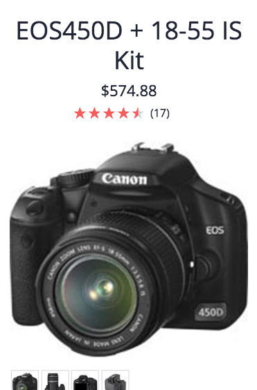
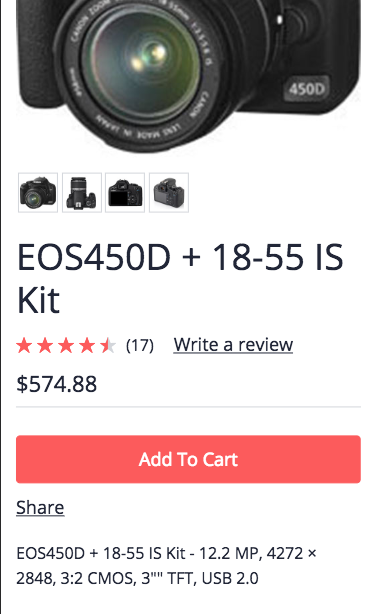

# Custom Styles

## Center name, price and rating on mobile

The following snippet demonstrates a configuration that will display a title group containing the name, price and rating above the product on mobile. The desktop layout remains unchanged.

```css
cx-product-summary {
  .name {
    @media (max-width: 992px) {
      text-align: center;
    }
  }

  .code {
    display: none;
  }

  .rating {
    @media (max-width: 992px) {
      grid-row: 3;
      justify-content: center;
    }

    a {
      display: none;
    }
  }

  .price {
    @media (max-width: 992px) {
      grid-row: 2;
      text-align: center;
    }
  }

  .description {
    margin-top: 20px;
  }
}
```

**Demo**



## Add to cart next to description

The following snippet allows for the add to cart button to be placed alongside the product information. The add to cart and quantity group is also customised. Indeed, the quantity selector is stacked vertically on top of the add to cart button and aligned with it's center.

```css
cx-product-summary {
  @media (min-width: 992px) {
    --cx-grid-template-columns: auto auto auto;

    .quantity {
      grid-row: 2;
      grid-column: 3;
      text-align: center;
      .info {
        display: none;
      }

      label {
        display: none;
      }
    }

    cx-add-to-cart {
      grid-row: 3;
      grid-column: 3;
      min-width: 200px;
    }

    .rating {
      grid-column: 2;
    }

    .description {
      grid-column: 2;
    }

    .price {
      grid-column: 2;
    }

    .share {
      grid-column: 2;
    }
  }

  .code {
    display: none;
  }
}
```

**Demo**


## Product name under product picture in mobile

The following snippet provides the necessary styling to have the product nmae under the product picture on mobile. The desktop layout remains unchanged.

``` css
cx-product-summary {
  .name {
    margin-top: 20px;
    grid-row: 2;

    @media (min-width: 992px) {
      grid-row: 1;
    }
  }

  .code {
    display: none;
  }

  .price {
    border-bottom: 1px solid var(--cx-light);
    padding-bottom: 10px;

    @media (min-width: 992px) {
      padding-bottom: 30px;
    }
  }

  .quantity {
    display: none;
  }

  .description {
    grid-row: 8;
    margin-top: 20px;
  }

  cx-add-to-cart {
    @media (min-width: 992px) {
      margin-top: 20px;
    }
  }
}
```

**Demo**


