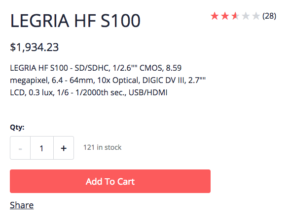
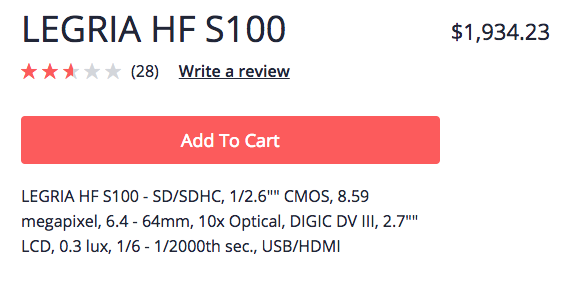
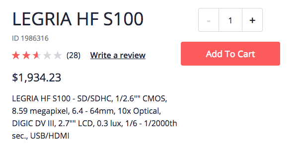

# Custom Styles

## Rating with title

The following snippet demonstrates a small configuration that will hide the product code and display the product rating next to the product title. In addition,the add review link is hidden.

```css
cx-product-summary .product-summary {
  --cx-grid-template-columns: minmax(20px, auto) minmax(20px auto);

  .item-title .code {
    display: none;
    --cx-align-items: center;
  }

  .item-rating {
    --cx-grid-row: 1;
    grid-row: 2;
    --cx-margin: 0 0 5px 0;

    .review-link {
      display: none;
    }
  }

  .description {
    --cx-margin: 10px 0 10px 0;
  }
}
```

**Demo**



## Price with title

Following a similar idea to the previous snippet, the following CSS provides a way to display the product price on the same line as the title.

```css
cx-product-summary .product-summary {
  --cx-grid-template-columns: minmax(20px, auto) minmax(20px auto);

  .item-title .code {
    display: none;
    --cx-align-items: center;
  }

  .price {
    --cx-grid-row: 1;
    grid-column: 2;
    margin: 0.5em;
  }

  .quantity {
    --cx-grid-row: 3;

    &-label {
      display: none;
    }

    &-counter {
      display: none;
    }
  }
}
```

**Demo**



## Add to cart with title

The following snippet allows for the add to cart button to be placed next to the title. The add to cart and quantity group is also customised. Indeed, the quantity selector is stacked vertically on top of the add to cart button and aligned with it's center.

```css
cx-product-summary .product-summary {
  --cx-grid-template-columns: minmax(20px, auto) minmax(20px auto);

  .quantity {
    --cx-grid-row: 1 / span 2;
    text-align: center;
    &-info {
      display: none;
    }

    &-label {
      display: none;
    }
  }

  cx-add-to-cart {
    min-width: 200px;
  }
}
```

**Demo**


